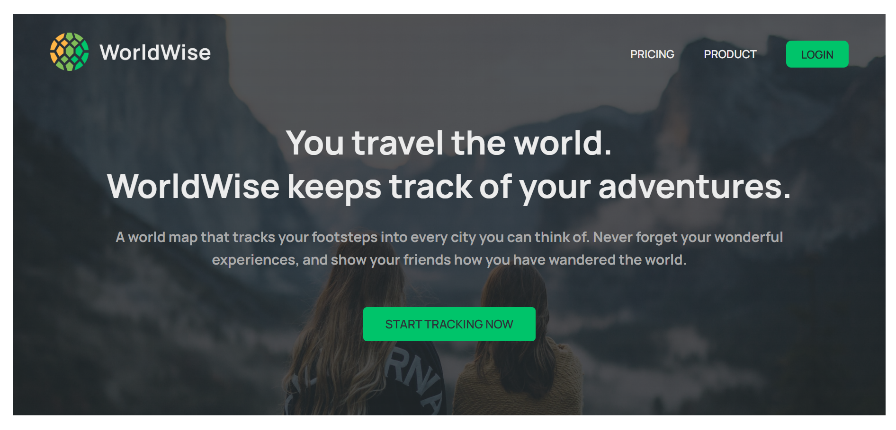
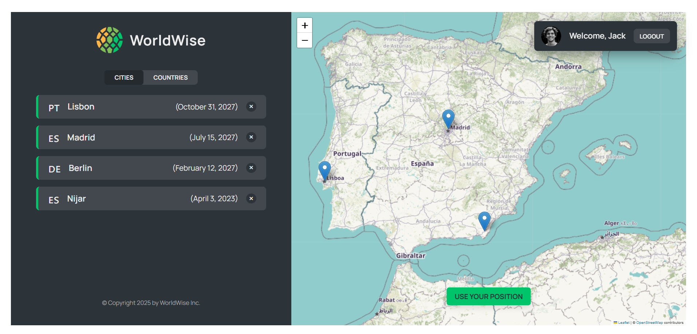
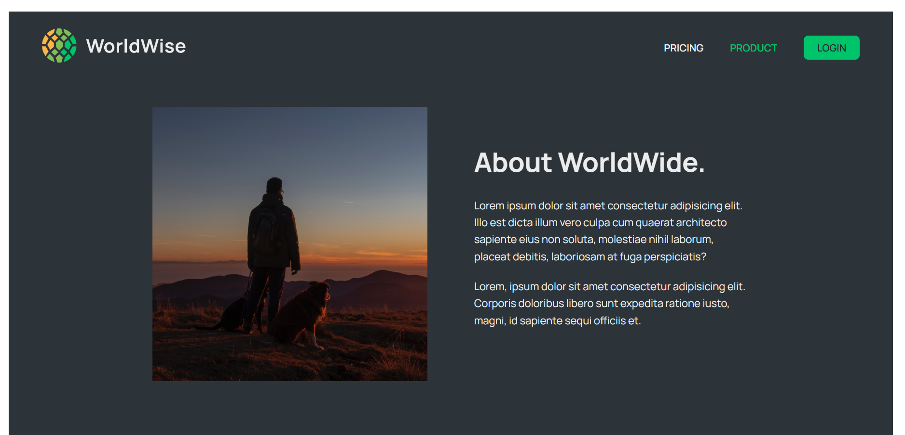

🌍 Worldwise

Worldwise is a travel history tracker where users can save and view the places they’ve visited around the world.
It’s built with React, making use of React Router for navigation and React Hooks (like useParams) to manage state and URL-based data.

✨ Features

📌 Add and manage travel history – Save details of cities or countries you’ve visited.

🗺️ Dynamic routing with React Router – Navigate between cities and trips seamlessly.

🔍 URL parameters with useParams – Load city/trip details directly from the URL.

⚡ Modern React hooks – Clean and efficient state management.

🎨 Responsive UI – Works smoothly on desktop and mobile.

🛠️ Tech Stack

Frontend: React, React Router

State Management: React Hooks (useState, useEffect, useParams)

Styling: CSS / Tailwind (update if you’re using something else)

Data Handling: Local JSON / (add API if applicable)

## 📸 Screenshots

### 🏠 Homepage

### 🌍 City Details Page

### ➕ About

### 🔧 This project is still in progress! I’ll be adding screenshots as I build new features.  
Stay tuned for updates!

🚀 Getting Started

Follow these steps to run the project locally:

# Clone the repository
git clone https://github.com/<your-username>/worldwise.git

# Navigate into the project
cd worldwise

# Install dependencies
npm install

# Start the development server
npm run dev

# React + Vite

This template provides a minimal setup to get React working in Vite with HMR and some ESLint rules.

Currently, two official plugins are available:

- [@vitejs/plugin-react](https://github.com/vitejs/vite-plugin-react/blob/main/packages/plugin-react/README.md) uses [Babel](https://babeljs.io/) for Fast Refresh
- [@vitejs/plugin-react-swc](https://github.com/vitejs/vite-plugin-react-swc) uses [SWC](https://swc.rs/) for Fast Refresh

